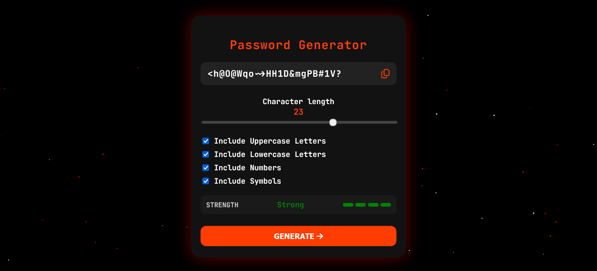
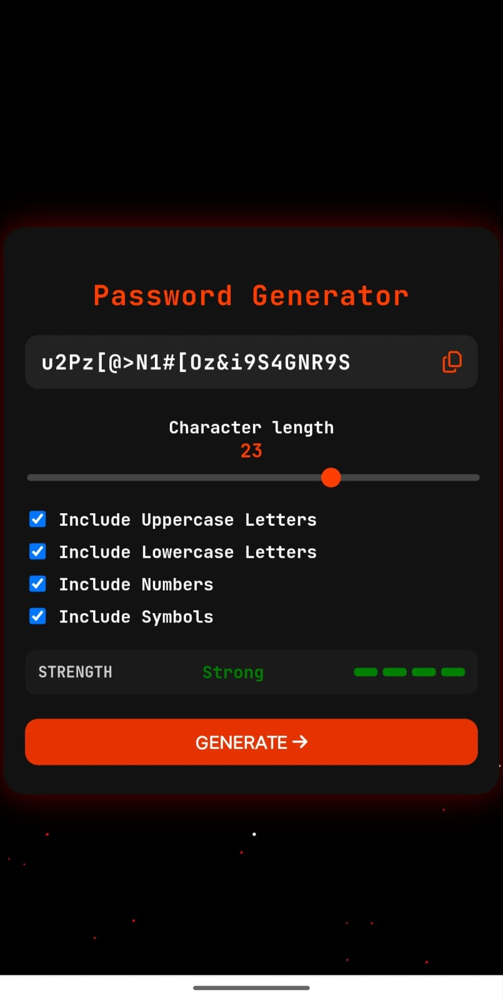

<h1 align="center">⚙️ Password Generator</h1>

<p align="center">
  
</p>

<p align="center">
  🔒 A simple, responsive and effective password generation tool built with plain JavaScript, HTML & CSS.<br>
  Safer passwords with just a click.
</p>

---

##  Live Demo

👉 **[Try It Now](https://password-gen-wine.vercel.app)**

---

##  Tech Stack

**Frontend:**  
  
  


**Deployment:**  


---

##  Screenshots

| Desktop View | Mobile View |
|--------------|-------------|
|  |  |

---

##  Features

-  Clean and minimal UI  
-  Generates strong, random passwords instantly  
-  Works offline—just opens in the browser  
-  Lightweight, fast and no external dependencies  
-  Easy to integrate or extend with more features (like length, character-type options)

---

##  Getting Started

To use this project locally:

```bash
# Clone this repository
git clone https://github.com/kamalkori28/PasswordGen.git

# Enter into the project folder
cd PasswordGen

# Open 'index.html' in your preferred browser
# Or serve it using a static server (e.g., VSCode Live Server)
